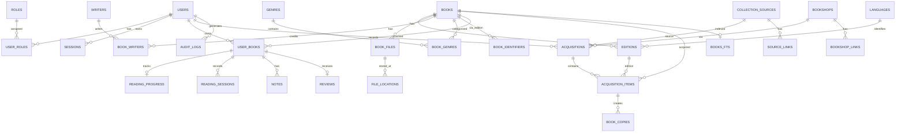

# ERD — KutubCore

```mermaid
erDiagram
    USERS ||--o{ USER_ROLES : has
    ROLES ||--o{ USER_ROLES : assigned
    USERS ||--o{ SESSIONS : owns
    BOOKS ||--o{ EDITIONS : has
    BOOKS ||--o{ BOOK_FILES : has
    BOOK_FILES ||--o{ FILE_LOCATIONS : stored_at
    BOOKS ||--o{ BOOK_WRITERS : credits
    WRITERS ||--o{ BOOK_WRITERS : writes
    LANGUAGES ||--o{ EDITIONS : identifies
    BOOKS ||--o{ BOOK_GENRES : categorized
    GENRES ||--o{ BOOK_GENRES : contains
    BOOKS ||--o{ BOOK_IDENTIFIERS : via_edition
    USERS ||--o{ USER_BOOKS : owns
    BOOKS ||--o{ USER_BOOKS : tracked
    USER_BOOKS ||--o| READING_PROGRESS : tracks
    USER_BOOKS ||--o{ READING_SESSIONS : records
    USER_BOOKS ||--o{ NOTES : has
    USER_BOOKS ||--o| REVIEWS : receives
    COLLECTION_SOURCES ||--o{ ACQUISITIONS : source
    BOOKSHOPS ||--o{ ACQUISITIONS : via
    USERS ||--o{ ACQUISITIONS : records
    ACQUISITIONS ||--o{ ACQUISITION_ITEMS : contains
    BOOKS ||--o{ ACQUISITION_ITEMS : acquired
    EDITIONS ||--o{ ACQUISITION_ITEMS : edition
    ACQUISITION_ITEMS ||--o{ BOOK_COPIES : creates
    BOOKSHOPS ||--o{ BOOKSHOP_LINKS : has
    COLLECTION_SOURCES ||--o{ SOURCE_LINKS : has
    USERS ||--o{ AUDIT_LOGS : generates
    BOOKS ||--o| BOOKS_FTS : indexed
```

Defining rule (Blueprint §20): Catalog identity, Edition identity, and
Personal Library identity are separate entities — see `DATABASE_SCHEMA.md`.
